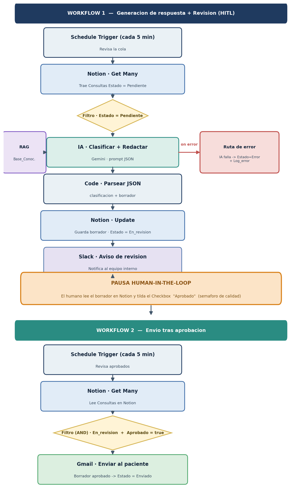

# 🏥 Recepción Inteligente — Ecosistema de Automatización IA Autónomo

Entrega Final — Arquitecto de Flujos IA. Un sistema de extremo a extremo que recibe consultas de pacientes de una clínica, las **clasifica y responde con IA**, las pasa por un **punto de aprobación humana (HITL)** y las envía, todo orquestado en **n8n**.

---

## 🎯 Caso de uso

Una clínica con recepción saturada. Cuando llega una consulta de un paciente, el sistema:

1. La detecta y la trae desde la base de datos.
2. La **clasifica** (Urgente / Normal / Administrativa) y **redacta un borrador de respuesta** con IA, apoyándose en una base de conocimiento privada (RAG).
3. **Se detiene** y avisa al equipo por Slack para que un humano apruebe.
4. Solo si el humano **aprueba**, envía la respuesta al paciente por Gmail.

---

## 🧱 Arquitectura



> El diagrama completo y la justificación están en [`docs/entrega_final_arquitectura.pdf`](./docs/entrega_final_arquitectura.pdf).

El sistema se divide en **dos workflows** unidos por el semáforo humano:

- **Workflow 1 — Generación + Revisión:** Schedule → Notion (Pendientes) → Filtro → IA (clasifica + redacta) → Code (parsea JSON) → Notion (guarda borrador, Estado = `En_revisión`) → Slack (aviso). Incluye **ruta de error**.
- **Workflow 2 — Envío tras aprobación:** Schedule → Notion (aprobados) → Filtro `En_revisión` **AND** `Aprobado = true` → Gmail (envía) → Notion (Estado = `Enviado`).

---

## 🛠️ Tecnologías integradas

| Capa | Tecnología | Rol |
|---|---|---|
| Orquestador | **n8n** | Flujo principal (2 workflows) |
| Base de datos | **Notion** | Memoria del sistema, estados y relación entre tablas |
| Procesamiento IA | **Gemini** * | Clasifica y redacta (prompt estructurado + RAG) |
| Canal de salida | **Gmail + Slack** | Gmail al paciente; Slack para la revisión interna |

\* El rubric admite OpenAI o Claude. Por no contar con acceso a sus APIs pagas, se utilizó el módulo equivalente de **Gemini**. La arquitectura evaluada es idéntica; solo cambia el proveedor del LLM.

---

## 🗄️ Base de datos (Notion)

Tres databases independientes y relacionadas:

- **`Consultas`** — Mensaje, Paciente (relación), Estado, Clasificación_IA, Borrador_respuesta, Aprobado (checkbox), Log_error.
- **`Pacientes`** — Nombre, Email (datos mínimos · principio de minimización).
- **`Base_Conocimiento`** — registros atómicos (un tema por fila) que alimentan el RAG.

🔗 **Base en modo lectura:** https://app.notion.com/p/1c348b0940a94bc1b81985e4d3757b2b?v=1516bd1a1d5841ca97454acbc49bf24f&source=copy_link - https://app.notion.com/p/b710f806c6b24922b02bf5d173b36c6a?v=d532acc0b384446d95d9594428989a72&source=copy_link - https://app.notion.com/p/4cfebbed02374347b7dd24567fc445a7?v=b18d7697c26741099dac1c1640dbf3fd&source=copy_link

---

## ✅ Requisitos de arquitectura cumplidos

- ✔️ Disparo y entrega **sin intervención manual**.
- ✔️ **Trigger inteligente**: filtro por Estado para no malgastar operaciones.
- ✔️ **Ruta de error**: continue-on-fail en la IA → Estado `Error` + `Log_error`.
- ✔️ **HITL**: pausa en `En_revisión`; el envío solo ocurre con `Aprobado = true`.
- ✔️ **Nodos nombrados** y **variables dinámicas** (sin datos hardcodeados).
- ✔️ **Sin bucles infinitos**: el avance de Estado saca la fila del filtro.
- ✔️ Comparación de **tipos de dato correctos** en los filtros (texto y booleano).

---

## 🔄 Ciclo de estados

`Pendiente` → `En_revisión` → (Checkbox Aprobado) → `Enviado`
&nbsp;&nbsp;&nbsp;&nbsp;↳ ante fallo de API → `Error` (+ Log_error)

---

## 📂 Contenido del repositorio

```
.
├── README.md
├── docs/
│   ├── entrega_final_arquitectura.pdf      # Diagrama + justificación
│   └── diagrama_arquitectura.png
├── workflows/
│   ├── workflow_1_generacion_revision.json # Blueprint n8n (W1)
│   └── workflow_2_envio_aprobado.json      # Blueprint n8n (W2)
└── screenshots/
    ├── flujo-principal.png
    └── flujo secundario.png

```

---

## ▶️ Cómo reproducirlo

1. Importar los dos `.json` de `workflows/` en n8n (Workflows → Import from File).
2. Configurar credenciales: **Notion** (Internal Integration Token, con las 3 databases compartidas con la integración), **Gemini** (Google AI Studio API key), **Gmail** (OAuth) y **Slack** (OAuth).
3. Crear las 3 databases en Notion con los campos descritos arriba y cargar registros de prueba.
4. Activar ambos workflows.

---
